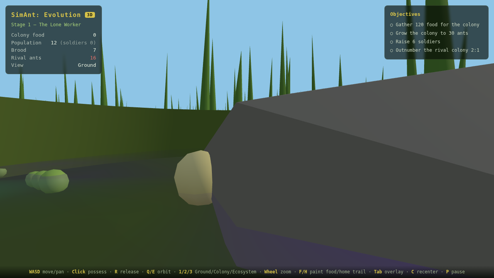
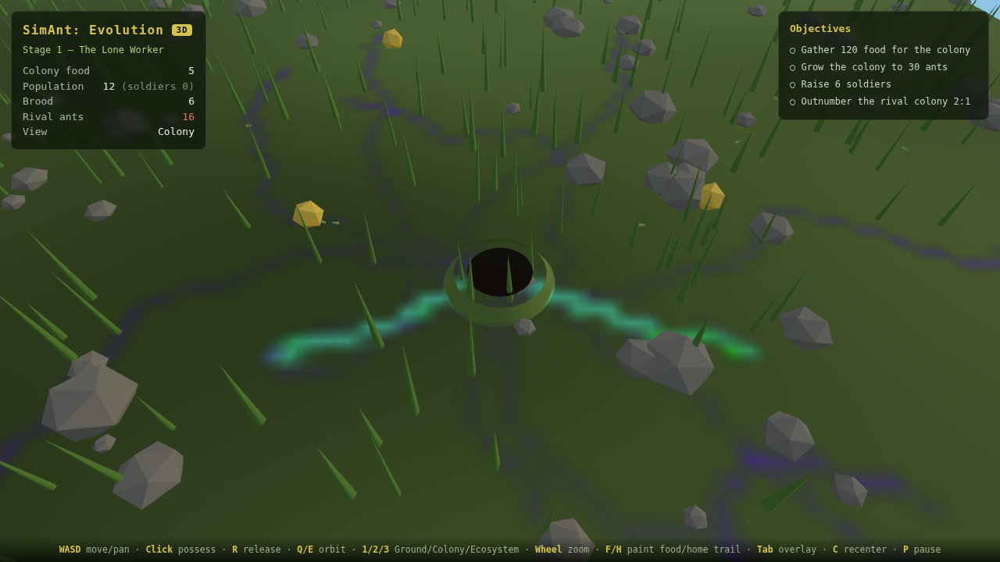
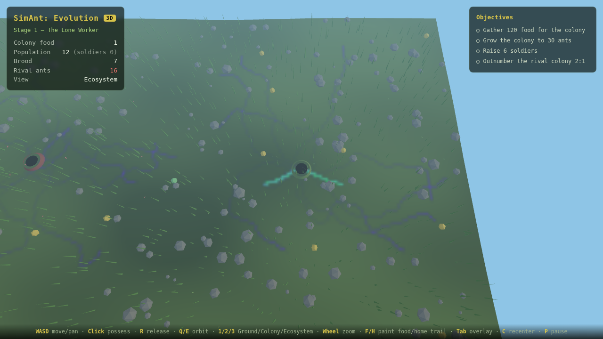

# SimAnt: Evolution

A modern reimagining of the SNES classic *SimAnt* — a living ant-colony
ecosystem where you begin as a single scout and grow a superorganism.

This repository is the **ship-ready foundation**: a genuinely playable vertical
slice of the core loop (lone worker → pheromone trails → colony growth → food
economy → combat) built on an architecture designed from day one to port to
**PC and console** editions. It ships a **fully 3D edition** (Three.js) with a
seamless Ground → Colony → Ecosystem camera, plus a 2D edition that shares the
exact same simulation.

| Ground — "six millimetres tall" | Colony — RTS boom | Ecosystem — the whole property |
| --- | --- | --- |
|  |  |  |

*One continuous zoom axis: drop to the ground and grass towers against the sky;
pull up and the pheromone highways of the whole ecosystem resolve at once. The
bright green trails are reinforced food routes that **emerge** — not scripted —
as ants discover a source and recruit nestmates to it.*

---

## Quick start

```bash
npm install
npm run dev        # play at http://localhost:5173
```

Other scripts:

| Script              | What it does                                             |
| ------------------- | -------------------------------------------------------- |
| `npm run build`     | Typecheck + production build to `dist/` (static, hostable)|
| `npm run preview`   | Serve the production build locally                        |
| `npm test`          | Run the deterministic simulation + unit test suite        |
| `npm run typecheck` | Strict TypeScript check, no emit                          |
| `npm run lint`      | ESLint over `src/`                                        |
| `npm run smoke`     | Headless browser smoke test of the built game             |

## Controls (3D edition)

Keyboard/mouse **and gamepad** are supported out of the box (the same code
path a console edition uses).

| Action                          | Keyboard / Mouse       | Gamepad        |
| ------------------------------- | ---------------------- | -------------- |
| Move ant (Ground) / pan camera  | `WASD` / arrows        | Left stick     |
| Possess ant under cursor        | left click             | A              |
| Release possession              | `R`                    | B              |
| Orbit camera                    | `Q` / `E`              | LB / RB        |
| Perspective: Ground/Colony/Eco  | `1` / `2` / `3`        | —              |
| Zoom (glide between views)      | mouse wheel / `+` `-`  | Right stick Y  |
| Paint food trail                | hold `F` (at cursor)   | X              |
| Paint home trail                | hold `H` (at cursor)   | D-pad up       |
| Toggle pheromone overlay        | `Tab`                  | Y              |
| Recenter camera                 | `C`                    | Back           |
| Pause                           | `P`                    | Start          |
| New world (on win/lose)         | `Enter` / `Space`      | A              |

The 2D edition (`?mode=2d`) uses the same actions with `E` to possess at the
cursor.

## How to play the slice

You command the **green** colony against a **red** rival. Foragers leave the
nest, find food, and lay trails home that other ants reinforce — so your job is
to shape the ecosystem, not micromanage every ant:

- **Possess** a worker (`E`) and drive it to a food source and back to
  bootstrap a trail by hand.
- **Paint** food/home trails (`F`/`H`) to steer traffic toward rich food or
  away from the rival.
- Stored food lets the queen lay eggs → larvae → pupae → new workers and
  soldiers. Grow, raise soldiers, and out-scale the rival to complete
  **Chapter 1 — Survival**.

## Architecture at a glance

The single most important engineering decision here is a hard seam between a
**deterministic simulation core** and a **thin platform layer**:

```
src/
  core/        Pure TypeScript simulation. No DOM, no Web APIs, no device I/O.
               Deterministic (seeded RNG + fixed timestep). Runs in a browser,
               in Node (tests), or embedded in a native console shell — byte
               for byte identically. Shared by BOTH the 2D and 3D editions.
  platform/    Device seams + reference web implementations:
                 InputSource / AudioSink  (shared by 2D and 3D)
                 Renderer (2D canvas)      + web/CanvasRenderer
                 Host3D   (3D surface)     + web/WebHost3D
                 three/   Three.js stage + instanced ant renderer (3D edition)
               A console port re-implements these against its SDK; core/ and
               game/ don't change.
  game/        Glue: fixed-step loop, cameras, HUD, objectives. Two controllers
               (Game = 2D, Game3D = 3D) drive the SAME Simulation.
```

The 3D edition renders with **GPU-instanced ants** (thousands in one draw call),
a **seamless three-mode camera** (`CameraRig`), a displaced-terrain world with
scale props, and a **day/night cycle** — all over the untouched deterministic
core. See [`docs/DESIGN_3D.md`](docs/DESIGN_3D.md).

Determinism (see `src/core/math/Rng.ts` and `Simulation.step`) is not
decoration: it is what makes save-states, replays, automated tests, console
certification repros, and future lockstep multiplayer possible.

See [`docs/ARCHITECTURE.md`](docs/ARCHITECTURE.md) for the full picture and
[`docs/PORTING.md`](docs/PORTING.md) for the PC/console porting guide.

## What's built vs. the full vision

The [design vision](docs/DESIGN.md) is a multi-year AAA scope. This foundation
deliberately implements the **core loop end-to-end** so every later system has
something real to extend. See [`docs/ROADMAP.md`](docs/ROADMAP.md) for how the
biomes, genetics, campaign, bosses, and multiplayer map onto this base.

## License

MIT — see [LICENSE](LICENSE).
